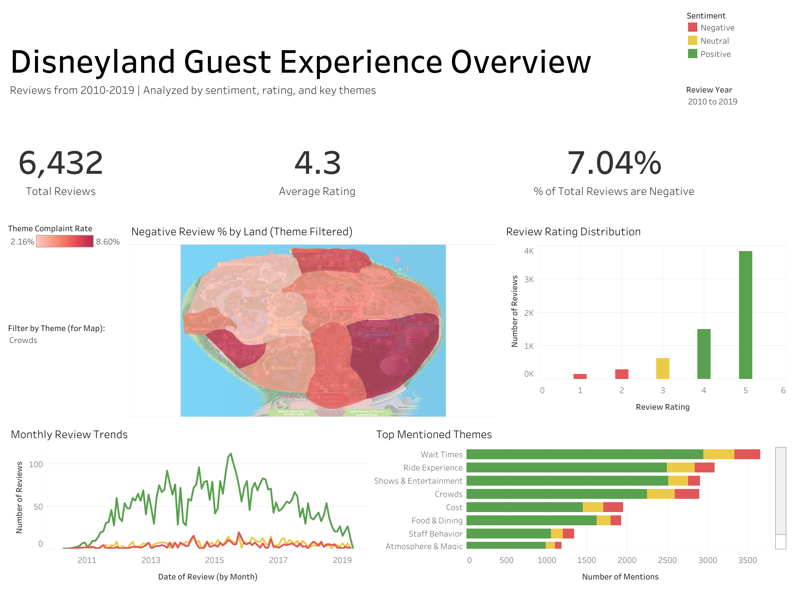
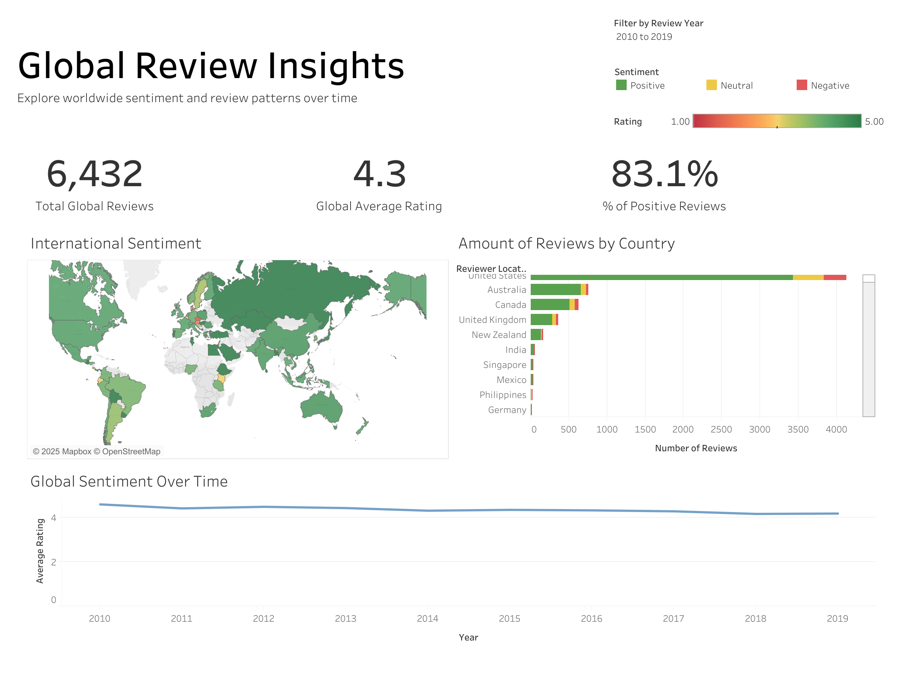

# Disneyland Reviews Analytics 

This project analyzes **Disneyland guest reviews** using **BigQuery** and **Tableau** to uncover insights into visitor sentiment, complaint themes, and geographic trends. It serves as a **portfolio project** to showcase data cleaning, transformation, visualization, and storytelling skills.

---

## Tools Used

- **Kaggle** → Dataset
- **SQL (BigQuery)** → Data wrangling, normalization, and theme calculations 
- **Tableau** → Interactive dashboards with filters, maps, and KPIs

---

## Dataset

- [Disneyland Reviews (via Kaggle)](https://www.kaggle.com/datasets/arushchillar/disneyland-reviews)  

Contains **42,000 reviews** across 3 Disneyland branches with: 
- **Review_ID** (unique identifier) 
- **Rating** (ranging from 1 to 5) 
- **Year_Month** (YYYY-MM) 
- **Reviewer_Location** (country of origin) 
- **Review Text** (guest comments) 
- **Disneyland_Branch** (location of Disney Park) 

> *This dataset is used strictly for **educational and portfolio purposes**. Credit to the original Kaggle authors.*
---

## Files Included

- `README.md` – Project overview 
- `Disney Metrics.twbx` - Tableau workbook with sheets and dashboards 
- `/sql` folder – Contains SQL queries used 
- `/csv` folder - Datasets exported for Tableau
- `/images` folder - Screenshots of dashboards and maps 

---

## Dashboards  

### 1. Disneyland Guest Experience Overview
- Map displaying % of negative reviews of Disneyland California filtered by theme
- Bar chart of review rating distribution 
- Top mentioned themes and associated sentiment 
- Line chart of review trends by month and sentiment 
- KPI "big numbers" for quick insight

### 2. Global Review Insights  
- Global map of origin of rating and associated rating
- Bar chart displaying reviewer location and quantity of review
- Line chart of global sentiment over time 
- KPI "big numbers" for quick insight  

---

## Key Features  

- **Interactive filtering** (selected theme, all themes, or "overall")  
- **Big Numbers**: KPIs summarizing complaints and sentiment  
- **Custom Calculations**: complaint % and average sentiment per country  

---

## Portfolio Links 

- Tableau Dashboards: [View on Tableau Public](https://public.tableau.com/views/DisneylandMetrics/GlobalOverview?:language=en-US&:sid=&:redirect=auth&:display_count=n&:origin=viz_share_link)  
- LinkedIn: [Connect with Me](https://www.linkedin.com/in/emma-rogoveanu)  

---

## License  

This repository is for educational and portfolio purposes only. All rights reserved.

Dataset credit: [Kaggle Disneyland Reviews Dataset](https://www.kaggle.com/datasets/arushchillar/disneyland-reviews)  

## About Me

**Emma Rogoveanu**  
[LinkedIn](https://www.linkedin.com/in/emma-rogoveanu) • [GitHub](https://github.com/emmabellerogo)
